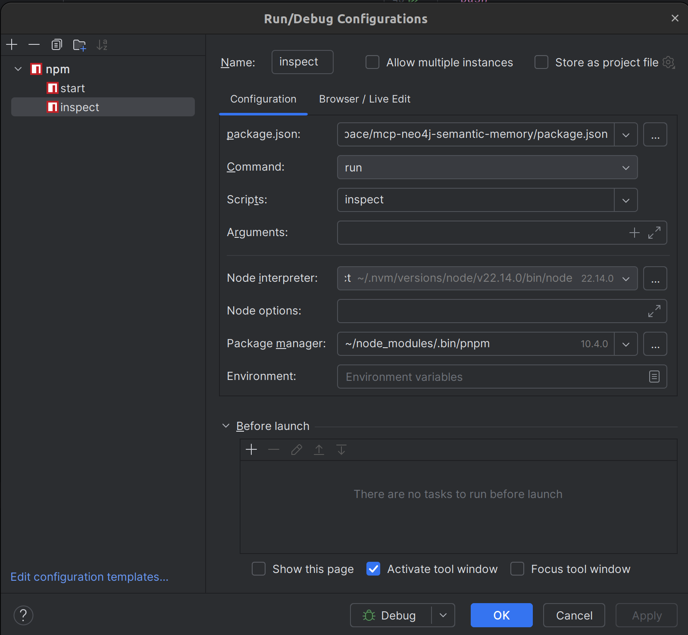

# Debugging with mcp-inspector

mcp-inspector has been helpful for debugging some of the subtle issues associated to LLM "sampling" or LLM call-outs. Calling out to an LLM to create automatically create a Semantic Ontology, and its associated cypher queries to persist the resulting network.

## Overview

`mcp-inspector` is a specialized tool designed to help developers and operators debug, inspect, and interact with MCP (Model Context Protocol) applications, including the `mcp-neo4j-semantic-memory` app. It provides a user-friendly interface for querying, visualizing, and troubleshooting the knowledge graph and tool interactions in real time.

---

## What is mcp-inspector?

`mcp-inspector` is a standalone utility that connects to MCP-compatible servers (like this app) via standard input/output or network protocols. It allows you to:

- Inspect the current state of the knowledge graph (entities, relationships, ontologies)
- Execute and debug tool calls (e.g., create_base_ontology, safe_cypher_query)
- Visualize graph structures and tool responses
- Monitor and trace requests, responses, and errors
- Interactively explore memory and tool APIs

---

## Installation

You can install `mcp-inspector` globally using npm:

```bash
npm install -g @modelcontextprotocol/inspector
```

Or run it directly with npx (no install required):

```bash
npx @modelcontextprotocol/inspector
```

---

## Connecting to the MCP App

### 1. Start the MCP App

First, ensure your MCP app (e.g., `mcp-neo4j-semantic-memory`) is running. For example:

```bash
MCP_SEMMEM_DEBUG=info npx mcp-neo4j-semantic-memory
```

### 2. Launch mcp-inspector

In a new terminal, start `mcp-inspector` and connect it to the running MCP app. The inspector can connect via stdio (default for local debugging) or via TCP if the app exposes a network port.

#### Example (stdio):

```bash
npx @modelcontextprotocol/inspector
```

#### Example (TCP):

```bash
npx @modelcontextprotocol/inspector --host 127.0.0.1 --port 8080
```

### 3. In the context of this app (mcp-neo4j-semantic-memory)...

All you have to do is run "pnpm inspect" to start up an mcp-inspector sesssion.
Additionally, you can setup the following in webstorm to debug you node based mcp server.



#### Debug Logging

For the sake of development, I added debug logging that activates when the
"MCP_SEMMEM_DEBUG": "debug", is set. It takes a typical log-level but just set it to "debug" if you need it. It produces a log to "/tmp/mcp-semmem-debug.log". As it it typical for an app to communicate with MCPs via STDIO, sending messages to the console seemed to be worthless, so the option to trace issues with a debug log is a big help.

#### Testing the MCP server under development

You can test the MCP server under development by using bash as the main command. Here's the setting for testing with Aider-Desk...

```json
{
  "mcpServers": {
    "SemMem-McpMemory": {
      "command": "/usr/bin/bash",
      "args": [
        "-c",
        "cd /home/dsidlo/workspace/mcp-neo4j-semantic-memory && node main.js"
      ],
      "env": {
        "LLM_API_PROVIDER": "openai",
        "LLM_API_MODEL": "gpt-4.1",
        "NEO4J_DATABASE": "mcpmemory",
        "MCP_SEMMEM_DEBUG": "debug",
        "ALLOW_CYPHER_QUERY_USER_INSISTS": "true"
      }
    }
  }
}
```

---

## Key Features and Workflows

### 1. Inspecting the Knowledge Graph
- Use the inspector's UI or CLI to browse entities, relationships, and ontologies.
- Query the graph using built-in tools (e.g., `read_graph`, `search_nodes`).
- Visualize the structure and properties of nodes and edges.

### 2. Executing Tool Calls
- Trigger tool calls (like `create_base_ontology`, `safe_cypher_query`) directly from the inspector.
- View request/response payloads, including errors and debug logs.
- Modify tool arguments and re-run for rapid troubleshooting.

### 3. Tracing and Debugging
- Monitor all requests and responses in real time.
- View detailed logs if `MCP_SEMMEM_DEBUG` is enabled in the app.
- Filter and search through logs, errors, and tool invocations.

### 4. Visualizing Relationships
- Use the graph visualization panel to see how entities and ontologies are connected.
- Highlight specific paths, relationships, or subgraphs for focused debugging.

---

## Example Usage

### Inspecting All Entities

1. Open the inspector.
2. Select the `read_graph` tool.
3. Execute and view the full graph structure.

### Debugging a Tool Call

1. Select `create_base_ontology` from the tool list.
2. Fill in the required parameters (e.g., subject, parent).
3. Submit the request and observe the response and any debug output.

### Searching for a Node

1. Use the `search_nodes` tool.
2. Enter a query string (e.g., `Artificial Intelligence`).
3. Review matching entities and their relationships.

---

## Tips for Effective Debugging

- Enable debug logging in the MCP app with `MCP_SEMMEM_DEBUG=info` or `verbose` for more details.
- Use the inspector's filtering and search features to quickly locate issues.
- Combine graph visualization with log tracing to understand complex interactions.
- Use the inspector to experiment with tool calls before integrating them into production workflows.

---

## Troubleshooting mcp-inspector

- **Cannot connect:** Ensure the MCP app is running and listening on the expected interface (stdio or TCP).
- **No data shown:** Verify the app is not blocked by firewalls or permissions, and that the correct database is selected.
- **Errors in tool calls:** Check the MCP app logs (e.g., `/tmp/mcp-semmem-debug.log`) for details.
- **Graph not updating:** Refresh the inspector or restart both the app and inspector.

---

## Further Resources

- [MCP Inspector GitHub](https://github.com/modelcontextprotocol/inspector)
- [MCP Protocol Documentation](https://github.com/modelcontextprotocol/spec)
- [Neo4j Semantic Memory Project](https://github.com/modelcontextprotocol/mcp-neo4j-semantic-memory)

---

`mcp-inspector` is an essential tool for anyone developing, debugging, or operating MCP-based knowledge graph applications. Use it to gain deep insight into your app's memory, tools, and interactions.
