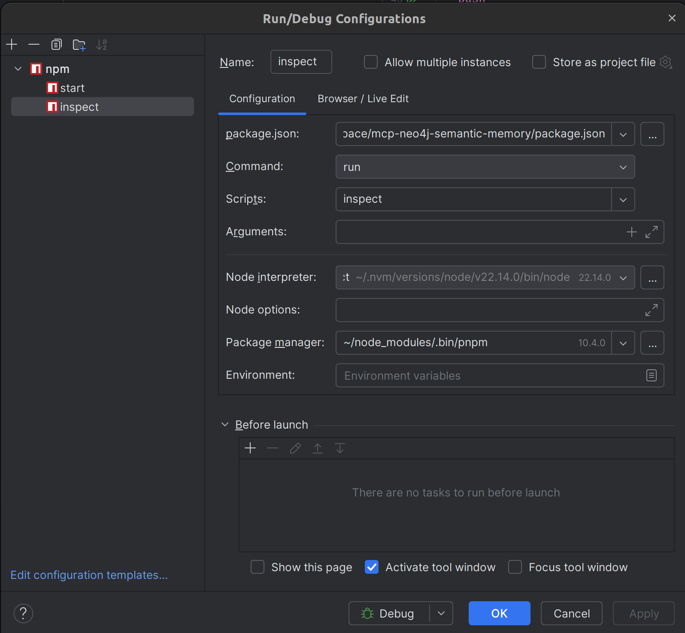

# Debugging `mcp-neo4j-semantic-memory`

## Overview

This MCP implementation includes a comprehensive debugging system that can be enabled to help troubleshoot issues or understand the flow of operations. This guide covers both built-in logging and debugging with the `mcp-inspector` tool.

`mcp-inspector` has been particularly helpful for debugging subtle issues related to LLM "sampling" or LLM call-outs, such as automatically creating a Semantic Ontology and its associated Cypher queries.

## Enabling Built-in Debug Logging

### Enabling Debugging

To enable the built-in debugging system, set the `MCP_SEMMEM_DEBUG` environment variable:

#### Debugging Environment variables

- **MCP_SEMMEM_DEBUG**='debug'
  - Output logs to /tmp/mcp-semmem-debug.log
- **NEO4J_UNSAFE_MEMORY_CYPHERS**='[false|true]'
  - Defaults to 'false', allows unsafe operations to occur.
- **ALLOW_CYPHER_QUERY_USER_INSISTS**='[false|true]'
  - Allows write operations, if user insists.
    - "Make some change to McpMemory."
      - Error: Security Node does not exist...
    - "Make some change to McpMemory.... I insist."
  - Does not require NEO4J_UNSAFE_MEMORY_CYPHERS to be set to true.


```bash
# Basic enabling (info level)
export MCP_SEMMEM_DEBUG=info

# Run with debugging enabled
MCP_SEMMEM_DEBUG=info npx mcp-neo4j-semantic-memory
```

### Debug Levels

You can specify different debug levels by setting the value of `MCP_SEMMEM_DEBUG`:

- `info`: General information (default if just enabled)
- `verbose`: More detailed logging
- `trace`: Extremely detailed logging including all function calls

Example:
```bash
export MCP_SEMMEM_DEBUG=verbose
```

### Debug Log Location

By default, logs are written to `/tmp/mcp-semmem-debug.log`. You can customize this location by setting the `MCP_SEMMEM_LOG_DIR` environment variable:

```bash
export MCP_SEMMEM_LOG_DIR=/path/to/your/logs
```

### Reading the Debug Logs

The debug logs use a consistent format:

```
[TIMESTAMP] [LOG_LEVEL] [FUNCTION_NAME] {JSON data}
```

You can follow the logs in real-time using:

```bash
tail -f /tmp/mcp-semmem-debug.log
```

### Advanced Debugging

For even more detailed debugging when working with Neo4j connections, you can also enable Neo4j driver logging:

```bash
NEO4J_LOGGING=debug MCP_SEMMEM_DEBUG=verbose npx mcp-neo4j-semantic-memory
```

## Debugging with `mcp-inspector`

### What is `mcp-inspector`?

`mcp-inspector` is a standalone utility that connects to MCP-compatible servers (like this app) via standard input/output or network protocols. It allows you to:

- Inspect the current state of the knowledge graph (entities, relationships, ontologies)
- Execute and debug tool calls (e.g., `create_base_ontology`, `safe_cypher_query`)
- Visualize graph structures and tool responses
- Monitor and trace requests, responses, and errors
- Interactively explore memory and tool APIs

### Installation

You can install `mcp-inspector` globally using npm:

```bash
npm install -g @modelcontextprotocol/inspector
```

Or run it directly with npx (no install required):

```bash
npx @modelcontextprotocol/inspector
```

### Connecting to the MCP App

#### 1. Start the MCP App

First, ensure your MCP app (e.g., `mcp-neo4j-semantic-memory`) is running. For example:

```bash
MCP_SEMMEM_DEBUG=info npx mcp-neo4j-semantic-memory
```

#### 2. Launch `mcp-inspector`

In a new terminal, start `mcp-inspector` and connect it to the running MCP app.

All you have to do is run `pnpm inspect` to start up an `mcp-inspector` session.

Alternatively, you can connect manually:

```bash
# Connect via stdio (default for local debugging)
npx @modelcontextprotocol/inspector

# Connect via TCP (if the app exposes a network port)
npx @modelcontextprotocol/inspector --host 127.0.0.1 --port 8080
```

#### 3. Debugging in an IDE (e.g., WebStorm)

You can set up your IDE to debug the Node.js-based MCP server with `mcp-inspector`.



### Key Features and Workflows

- **Inspecting the Knowledge Graph**: Use the inspector's UI or CLI to browse entities, relationships, and ontologies.
- **Executing Tool Calls**: Trigger tool calls directly from the inspector to view request/response payloads, including errors and debug logs.
- **Tracing and Debugging**: Monitor all requests and responses in real time.
- **Visualizing Relationships**: Use the graph visualization panel to see how entities and ontologies are connected.

### Example Usage

- **Inspect All Entities**: Open the inspector, select the `read_graph` tool, execute, and view the full graph structure.
- **Debug a Tool Call**: Select a tool like `create_base_ontology`, fill in parameters, and submit the request to observe the response and debug output.
- **Search for a Node**: Use the `search_nodes` tool with a query string to review matching entities.

### Tips for Effective Debugging

- Enable debug logging in the MCP app with `MCP_SEMMEM_DEBUG=info` or `verbose` for more details.
- Use the inspector's filtering and search features to quickly locate issues.
- Combine graph visualization with log tracing to understand complex interactions.
- Use the inspector to experiment with tool calls before integrating them into production workflows.

## Testing the MCP Server Under Development

You can test the MCP server under development by using bash as the main command. Here's a sample configuration for testing with Aider-Desk:

```json
{
  "mcpServers": {
    "SemMem-McpMemory": {
      "command": "/usr/bin/bash",
      "args": [
        "-c",
        "cd /home/dsidlo/workspace/mcp-neo4j-semantic-memory && node main.js"
      ],
      "env": {
        "LLM_API_PROVIDER": "openai",
        "LLM_API_MODEL": "gpt-4.1",
        "NEO4J_DATABASE": "mcpmemory",
        "MCP_SEMMEM_DEBUG": "debug",
        "ALLOW_CYPHER_QUERY_USER_INSISTS": "true"
      }
    }
  }
}
```

Keep in mind that .env files are also read, first from your home dir "~/.env", then from the current working dir ".env", then the env vars in the JSON structure. In that order, the the later, overriding the earlier.

## Troubleshooting

### Common Issues
- **No Debug Output**:
  1. Verify the environment variable is set (`echo $MCP_SEMMEM_DEBUG`).
  2. Check that the log directory is writable.
  3. Look for initialization errors in the console output.
- **Neo4j Connection Issues**: Set `MCP_SEMMEM_DEBUG=verbose` to see detailed connection attempts and errors.

### `mcp-inspector` Issues
- **Cannot connect**: Ensure the MCP app is running and listening on the expected interface (stdio or TCP).
- **No data shown**: Verify the app is not blocked by firewalls or permissions, and that the correct database is selected.
- **Errors in tool calls**: Check the MCP app logs (e.g., `/tmp/mcp-semmem-debug.log`) for details.

## Further Resources

- [MCP Inspector GitHub](https://github.com/modelcontextprotocol/inspector)
- [MCP Protocol Documentation](https://github.com/modelcontextprotocol/spec)
- [Neo4j Semantic Memory Project](https://github.com/modelcontextprotocol/mcp-neo4j-semantic-memory)
